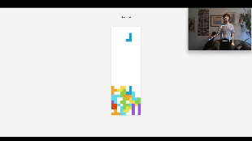
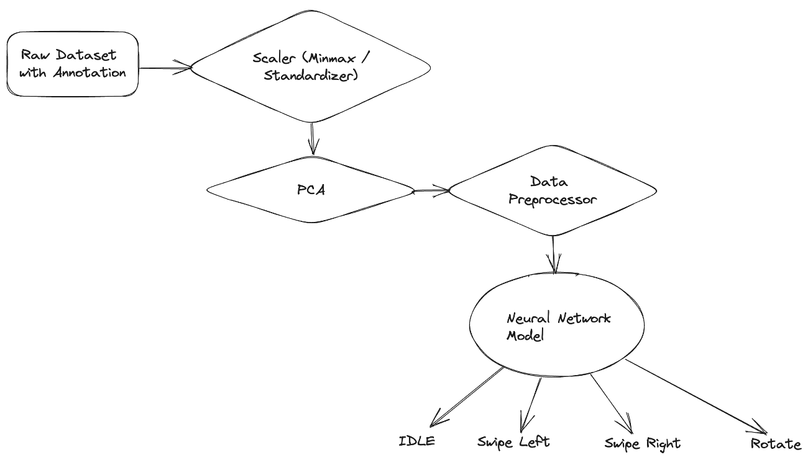
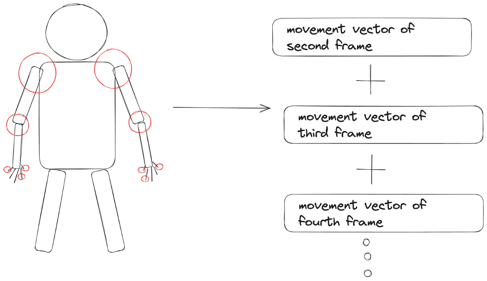

# Slideshow and Tetris Control with Gesture Recognition

> This project was created as part of the Machine Learning course at the University of Würzburg.


## Project Description

This project aims to control a slideshow and a tetris game with gestures. The gestures are recognized by a machine learning model that was trained on annotated video gestures. For generating train data, videos of gestures were recorded, annotated and preprocessed before being fed into the model.

## Machine Learning Library

As a machine learning library, my self-made [Neural Network Framework](https://github.com/strasserpatrick/neural_network_framework) is used. The framework is programmed in Python and numpy without any further Machine Learning libraries. The mathematics behind backpropagation taught in Machine Learning lecture is put into practice in this framework.

By training the library on the annotated video gestures, the model is able to recognize gestures in real-time. The model is then used to control a slideshow and a tetris game.

## Tetris Teaser




## Setup

### Environment

This is an optional step for setting up a virtual environment designated for the project.


```bash
git clone <link-to-repo>
python -m venv .venv
source .venv/bin/activate
```

### Installation of Requirements

```bash
pip install -r requirements
```

### Slideshow

To run the slideshow, run the following command:

```bash
python src/gesture_control/slidehow/live_detection.py
```

Then go to your browser and open `127.0.0.1:8000`.

### Tetris

To run tetris, run the following command:

```bash
python src/gesture_control/tetris/live_detection.py
```

Then go to your browser and open `127.0.0.1:8000`.

## Dataset Creation

The dataset was created by recording videos of gestures with a webcam. The videos were then annotated with the help of a annotation tool. The tool allows to annotate each gesture by specifying the interval of the gesture and labeling it. The tool then saves the timestamps of the gestures which can later be joined with the video frames to create the dataset.

## Preprocessing

The preprocessing of the video gestures is done with the help of `OpenCV` and `Mediapipe` which return three-dimensional coordinates of detected body landmarks. In training, the landmark coordinates are combined with gesture annotations and saved as a numpy array. 



As contemplating only a single frame for gesture classification does not provide enough information about hand movement, a bundle of consecutive frames is considered.



Instead of using the raw landmark coordinates, the relative coordinates are used. The relative coordinates are calculated by subtracting the coordinates of the previous frame from the coordinates of the current frame. This way, the hand movement is captured instead of the absolute position of the hand which is not relevant for gesture classification.
